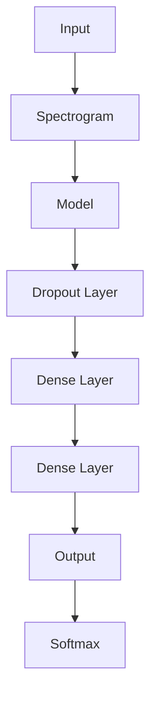

# GTZAN Music Classifier
## Description, Goal, and Details

Around 125 days worth of songs is uploaded to Spotify every 24 hours. This amount of data makes human classification almost impossible, and highly subjective, which necessitates an automated solution. Our AI solution is based on the GTZAN dataset which is a dataset containing 100 songs of 10 different genres, but can be extended as required. We will use a NN model, along with clustering algorithms to create our classifier. Our main goal is to automatically classify music for streaming services (although they likely have their own already), and private individuals' music collections, helping organize their music by genre.

## Dataset

The GTZAN dataset is a collection of 1,000 audio tracks, each 30 seconds long, spanning 10 different genres: blues, classical, country, disco, hip-hop, jazz, metal, pop, reggae, and rock. The dataset is widely used for music genre classification tasks and is available for download from various sources online. The audio files are in WAV format and can be easily processed using Python libraries such as librosa or pydub.

### Data Preprocessing

1. Split the audio files into smaller segments (e.g., 5 seconds) to create a larger dataset.
2. Convert the audio files to a suitable format (e.g., mono, 16 kHz) for processing.

This is done to create square-ish spectrograms, which improves model performance.
Especially for Pretrained models, as they expect square images, and crop/zero-fill any images that are not square.

Furthermore, this allows us to create a larger dataset, which allows for better training and validation of the model.

### Data Augmentation
We do not apply any data augmentation, as standard flipping and rotation does not apply to audio data.

We also do not apply any noise augmentation, as the spectrograms are already noisy enough, and adding more noise would not help the model learn.
Furthermore, there is already significant distortion in the audio files, per https://arxiv.org/pdf/1306.1461.

### Data Splitting
We split the dataset into 80% training, and 20% validation. This is done to ensure that the model is trained on a large enough dataset, while still being able to validate and test the model on unseen data.

## Model

We use standard image classification models, such as ResNet50, ResNet50V2, MobileNetV2, and XCeption.
We augment the model with 2 additional hidden dense layers, and a dropout layer to prevent overfitting, and allow more non-linearity.

We use a ReduceLROnPlateau callback to reduce the learning rate when the model stops improving.
Furthermore, we use a EarlyStopping callback to stop training when the model stops improving - this is mostly for those models which significantly overfit to a single category in the beginning, and do not escape this spiral.

## Model Architecture

### Spectrogram
The spectrogram is a visual representation of the spectrum of frequencies in a sound signal as they vary with time.

#### Mel Spectrogram
The Mel spectrogram is a spectrogram where the frequencies are converted to the Mel scale, which is a perceptual scale of pitches. The Mel scale is based on the human ear's response to different frequencies, and it is designed to mimic the way humans perceive sound. The Mel scale is non-linear, meaning that it compresses higher frequencies more than lower frequencies, which makes it more suitable for audio analysis tasks.

#### Multi-STFT Spectrogram
The Multi-STFT spectrogram is a spectrogram that uses multiple Short-Time Fourier Transforms (STFT) to capture the frequency content of the audio signal at different time intervals. This allows for a more detailed representation of the audio signal, which can improve the performance of the model. The Multi-STFT spectrogram is created by applying multiple STFTs with different window sizes and overlap percentages, and then concatenating the resulting spectrograms into a single representation.
We use 3 different STFTs, to emulate the 3 RGB channels of an image, and create a 3 channel spectrogram.

#### STFT
The Short-Time Fourier Transform (STFT) is a mathematical technique used to analyze the frequency content of a signal over time. It works by dividing the signal into small overlapping segments, applying a Fourier transform to each segment, and then combining the results into a time-frequency representation. The STFT provides a way to visualize how the frequency content of a signal changes over time, which is useful for audio analysis tasks such as music genre classification.

#### 1D Spectrogram
We "fake" the RGB channels in single channel spectrograms by repeating the single channel 3 times, creating a 3 channel spectrogram. This allows us to use standard image classification models, which expect 3 channel images.

## Model Training
We use Hyperband optimization to find the best hyperparameters for the model. This is done using the Keras Tuner library, which allows us to easily define and search for the best hyperparameters for our model.
We use the following hyperparameters:
- Learning rate: The learning rate is the step size used to update the model's weights during training. A smaller learning rate will result in slower convergence, while a larger learning rate may cause the model to overshoot the optimal solution.
- Image classification model: The image classification model is the base model used for transfer learning. We use standard image classification models, such as ResNet50, ResNet50V2, MobileNetV2, and XCeption.
- Spectrogram type: The spectrogram type is the type of spectrogram used for training. We use the following spectrogram types:
  - Mel spectrogram
    - Number of Mel bands
  - Multi-STFT spectrogram
    - Starting Window size
    - Ending Window size
    - Window steps
  - STFT spectrogram
    - Window size
    - Window steps

## Model Evaluation
We use the following metrics to evaluate the model:
- Accuracy: The accuracy is the percentage of correctly classified samples in the validation set. It is calculated as the number of correct predictions divided by the total number of samples.
- Precision: The precision is the percentage of true positive predictions divided by the total number of positive predictions. It is calculated as the number of true positives divided by the sum of true positives and false positives.
- Recall: The recall is the percentage of true positive predictions divided by the total number of actual positive samples. It is calculated as the number of true positives divided by the sum of true positives and false negatives.
- F1 score: The F1 score is the harmonic mean of precision and recall. It is calculated as 2 * (precision * recall) / (precision + recall).

## Model Inference
We use the following methods to infer the model:
- Normalize the input data to the same range as the training data.
- Chunk the input data into smaller segments (e.g., 5 seconds) with a sliding window.
- Infer the model on each segment and average the predictions to get the final prediction for the entire audio file.
- Use the predicted class with the highest probability as the final prediction for the audio file.
